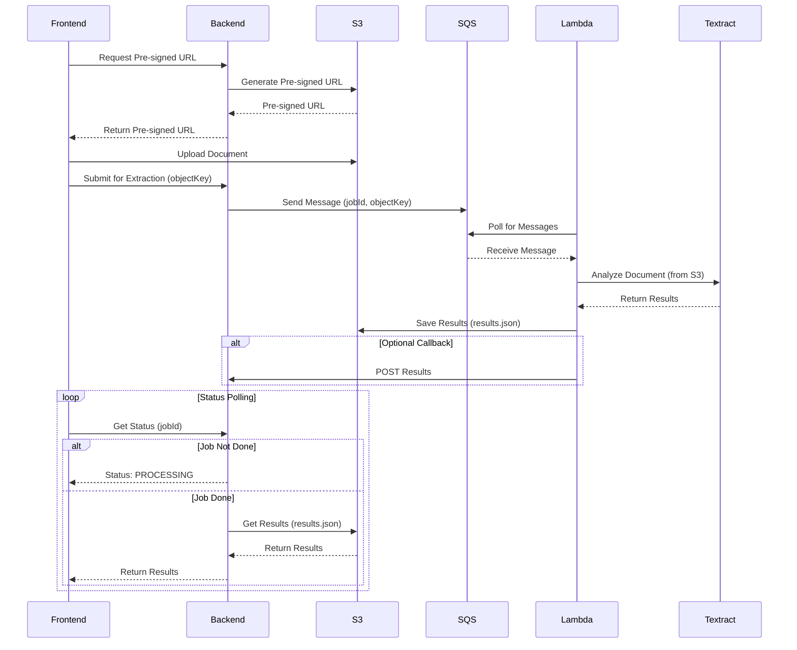

# AWS Textract Integration in Motor 2 Flow

This report details the end-to-end workflow of how AWS Textract is used for document processing in the Motor 2 insurance quotation flow.

## 1. Overview

The system uses a hybrid approach where the frontend uploads documents directly to a pre-signed S3 URL, and a Lambda function, triggered by an SQS message, processes the document with AWS Textract.

## 2. Frontend: Document Upload

- **Component**: `DocumentsUpload.js`
- **Functionality**: This component is responsible for handling the document picking and uploading process.

### Workflow:

1.  **Document Selection**: The user selects a document (ID, Logbook, etc.) using `expo-document-picker`.
2.  **Pre-signed URL Request**: The `HybridDocumentService` is called, which in turn makes a request to the Django backend to get a pre-signed S3 URL for the upload.
3.  **Direct S3 Upload**: The document is uploaded directly to the pre-signed S3 URL from the user's device.
4.  **Extraction Submission**: After a successful upload, the frontend submits the S3 object key to the backend to initiate the Textract extraction process.
5.  **Status Polling**: The frontend then polls a status endpoint on the backend to check the progress of the extraction.

## 3. Backend: Orchestration

- **Component**: `hybrid_document_views.py` (and the corresponding service logic)
- **Functionality**: The backend is responsible for orchestrating the document processing workflow.

### Workflow:

1.  **Generate Pre-signed URL**: When the frontend requests a pre-signed URL, the backend generates one using `boto3` and returns it.
2.  **Submit to SQS**: When the frontend submits the S3 object key for extraction, the backend creates a job and sends a message to an SQS queue. This message contains the `jobId` and the `objectKey` of the document in S3.
3.  **Status & Results**: The backend provides endpoints for the frontend to poll for the job status and retrieve the final extraction results once they are available.

## 4. AWS Lambda: Textract Processing

- **Component**: `lambda_textract.py`
- **Functionality**: This Lambda function is the core of the document processing pipeline.

### Workflow:

1.  **SQS Trigger**: The Lambda function is triggered by a new message in the SQS queue.
2.  **Textract Analysis**: It parses the SQS message to get the `jobId` and `objectKey`, then calls the AWS Textract `analyze_document` API with the `FORMS` and `TABLES` feature types.
3.  **Save Results**: The raw JSON response from Textract is saved to a different S3 path (`textract-results/{jobId}.json`).
4.  **Callback (Optional)**: If a callback URL is provided in the SQS message, the Lambda function will send an HTTP POST request to the Django backend with the extraction results.

## 5. Data Flow Summary

## 6. Conclusion

The document upload and processing workflow is a well-architected, scalable, and robust solution. It correctly offloads the heavy lifting of document processing to AWS Lambda and Textract, ensuring the main application remains responsive. The use of SQS decouples the components, making the system resilient to failures.

The code in `DocumentsUpload.js` is currently set to skip the Textract processing. To enable it, the commented-out code block needs to be re-enabled. The backend and Lambda infrastructure appears to be correctly set up as per the `TEXTRACT_QUICKSTART.md` documentation.
