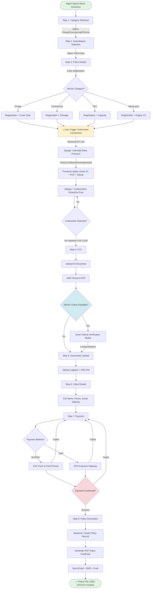
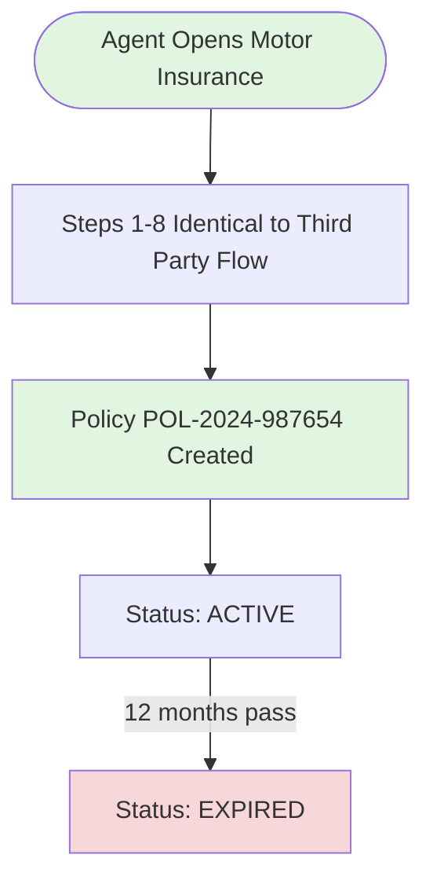
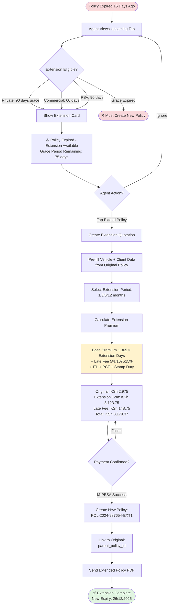

# Motor Insurance User Flow by Product Type

## Document Purpose

This document provides a comprehensive breakdown of the **user journey/flow** for all Motor Insurance products in the PataBima application. Products are grouped into **3 main product types** based on coverage and extensibility:

1. **Third Party (TP)** - Basic third-party liability coverage (non-extendible)
2. **Third Party Extendible (TP_EXT)** - Third-party coverage that can be extended beyond expiry
3. **Comprehensive (COMP)** - Full coverage including own damage, theft, and third-party liability

---

## Table of Contents

- [Overview](#overview)
- [Product Type Classification](#product-type-classification)
- [Visual Flow Diagrams](#visual-flow-diagrams)
- [Universal Flow Steps](#universal-flow-steps)
- [Flow Type 1: Third Party (TP)](#flow-type-1-third-party-tp)
- [Flow Type 2: Third Party Extendible (TP_EXT)](#flow-type-2-third-party-extendible-tp_ext)
- [Flow Type 3: Comprehensive (COMP)](#flow-type-3-comprehensive-comp)
- [Category-Specific Flows](#category-specific-flows)
- [Technical Implementation Notes](#technical-implementation-notes)

---

## Overview

### System Architecture

- **Frontend**: React Native (Motor2 & Motor3 flows)
- **Backend**: Django REST API with PostgreSQL
- **Pricing Engine**: Real-time calculation based on product type, category, and inputs
- **State Management**: React Context API with reducers
- **Caching**: Two-tier (Memory + AsyncStorage) for categories, pricing, underwriters

### Key Concepts

- **Pricing Model**: Determines how premium is calculated (FIXED, BRACKET, TONNAGE, PASSENGER, ENGINE_CC)
- **Product Type**: Determines the coverage level (THIRD_PARTY, THIRD_PARTY_EXT, COMPREHENSIVE, TOR)
- **Additional Fields**: Dynamic form fields required based on subcategory (tonnage, capacity, engine_cc)
- **Mandatory Levies**: Applied to ALL products (ITL 0.25%, PCF 0.25%, Stamp Duty KSh 40)

---

## Product Type Classification

All 60+ motor insurance products fall into **3 main groups**:

### 1. Third Party (TP) - Non-Extendible

**Coverage**: Basic third-party liability only (injury/damage to others)

**Characteristics**:

- ❌ Cannot be extended beyond expiry date
- ⚡ Quick pricing (often FIXED rates)
- 📋 Minimal form fields required
- 🚫 No add-ons available

**Products**: 31 subcategories across all categories

### 2. Third Party Extendible (TP_EXT)

**Coverage**: Third-party liability with extension option

**Characteristics**:

- ✅ Can be extended 30-90 days post-expiry (varies by category)
- ⚡ Similar pricing to TP
- 📋 Same form requirements as TP
- 💼 Extension creates new policy with prorated premium

**Products**: 17 subcategories across all categories

### 3. Comprehensive (COMP)

**Coverage**: Full coverage (own damage + theft + third-party)

**Characteristics**:

- 💎 Highest premiums (based on vehicle value)
- 📝 Extended form fields (sum insured, vehicle details)
- ➕ Add-ons available (Excess Protector, Windscreen, etc.)
- 🔄 Requires vehicle valuation/verification
- 🚫 Cannot be extended (must renew or create new policy)

**Products**: 12 subcategories across categories

---

## Visual Flow Diagrams

### Third Party (TP) Flow Diagram



---

### Third Party Extendible (TP_EXT) Flow Diagram

**Initial Policy Creation (Same as TP)**:



**Extension Flow (Post-Expiry)**:



---

### Comprehensive (COMP) Flow Diagram

```mermaid
flowchart TD
    Start([Agent Opens Motor Insurance]) --> Step1[Step 1: Category Selection]
    Step1 --> |Select Private/Commercial/PSV| Step2[Step 2: Subcategory Selection]
    Step2 --> |Select Comprehensive| Step3[Step 3: Policy Details Extended Form]

    Step3 --> CoreFields[Core Fields:<br/>Registration, Sum Insured,<br/>Year, Make & Model]
    CoreFields --> CategoryFields{Category-Specific?}

    CategoryFields --> |Private| PrivateComp[Sum Insured: KSh 100k-20M]
    CategoryFields --> |Commercial| CommercialComp[Tonnage + Sum Insured]
    CategoryFields --> |PSV| PSVComp[Capacity + Sum Insured]
    CategoryFields --> |Motorcycle| MotorcycleComp[Engine CC + Sum Insured]

    PrivateComp --> WaitInput{Sum Insured Entered?}
    CommercialComp --> WaitInput
    PSVComp --> WaitInput
    MotorcycleComp --> WaitInput

    WaitInput --> |No| Step3
    WaitInput --> |Yes KSh 1,200,000| TriggerCompare[⚡ Trigger Comparison<br/>1 second debounce]

    TriggerCompare --> BackendComp[Django: Query Bracket Pricing<br/>KSh 1M-2M Range @ 7.5%]
    BackendComp --> CalcBase[Base Premium:<br/>1,200,000 × 0.075 = KSh 90,000]
    CalcBase --> ApplyLevies[Apply Levies:<br/>ITL + PCF + Stamp Duty]
    ApplyLevies --> SortUW[Sort 7 Underwriters<br/>by Total Premium]

    SortUW --> Step4[Step 4: Underwriter Selection<br/>Dedicated Screen]

    Step4 --> DisplayCards[📊 Side-by-Side Cards:<br/>Jubilee: KSh 85,932<br/>ICEA: KSh 79,230<br/>UAP: KSh 92,180<br/>+ 4 more]
    DisplayCards --> ShowDetails[Show Rating, Claims Speed,<br/>Available Add-ons Preview]

    ShowDetails --> SelectUW{Underwriter Selected?}
    SelectUW --> |No| Step4
    SelectUW --> |Yes Jubilee| Step5[Step 5: Add-ons Selection]

    Step5 --> OfferAddons[Optional Coverages:<br/>☑ Excess Protector +2,500<br/>☑ Windscreen +3,000<br/>☐ Radio/Accessories +1,500<br/>☐ Political Violence +5,000<br/>☐ Loss of Use +3,500<br/>☐ Courtesy Car +8,000]

    OfferAddons --> CalcAddons[Selected: 2 add-ons<br/>Add-ons Total: KSh 5,500<br/>New Total: KSh 91,432]

    CalcAddons --> SkipOrContinue{User Action?}
    SkipOrContinue --> |Skip| Step6[Step 6: Client Details]
    SkipOrContinue --> |Continue| Step6

    Step6 --> FillClient[Full Name, Phone,<br/>Email, Address]
    FillClient --> Step7[Step 7: Payment]

    Step7 --> PaymentMethod{Payment Method?}
    PaymentMethod --> |M-PESA| MPESA[STK Push:<br/>KSh 91,432]
    PaymentMethod --> |Card| DPO[DPO Gateway]

    MPESA --> ConfirmPay{Confirmed?}
    DPO --> ConfirmPay

    ConfirmPay --> |Failed| Step7
    ConfirmPay --> |Success| Step8[Step 8: Policy Generation]

    Step8 --> CreatePolicy[Create Policy:<br/>POL-2025-XXXXXX]
    CreatePolicy --> GenerateDocs[Generate:<br/>- Policy Certificate PDF<br/>- Quotation PDF<br/>- Insurance Sticker]

    GenerateDocs --> SendNotif[Send:<br/>📧 Email with attachments<br/>📱 SMS with policy number<br/>🔔 Push notification]

    SendNotif --> UpdateAgent[Update Agent Dashboard:<br/>+ Sales count<br/>+ Commission earned<br/>+ Renewal tracking]

    UpdateAgent --> Success([✅ Comprehensive Policy Created<br/>Coverage: Own Damage + Theft + TP<br/>Premium: KSh 91,432<br/>Valid: 12 months])

    style Start fill:#e1f5e1
    style Success fill:#e1f5e1
    style TriggerCompare fill:#fff3cd
    style Step4 fill:#d1ecf1
    style Step5 fill:#d1ecf1
    style ConfirmPay fill:#f8d7da
```



---

### Flow Comparison Summary

```mermaid
flowchart LR
    subgraph TP["Third Party (TP)<br/>5-8 minutes"]
        TP1[Category] --> TP2[Subcategory]
        TP2 --> TP3[Policy Details<br/>Auto-Compare]
        TP3 --> TP4[KYC]
        TP4 --> TP5[Documents]
        TP5 --> TP6[Client Details]
        TP6 --> TP7[Payment]
        TP7 --> TP8[Submission]
    end

    subgraph TPEXT["Third Party Extendible (TP_EXT)<br/>5-8 min + Extension 3-5 min"]
        EXT1[Same as TP:<br/>Steps 1-8] --> EXT2[Policy Expires]
        EXT2 --> EXT3[Grace Period:<br/>30-90 days]
        EXT3 --> EXT4[Extension Flow:<br/>Duration + Payment]
        EXT4 --> EXT5[New Policy<br/>with -EXT1 suffix]
    end

    subgraph COMP["Comprehensive (COMP)<br/>10-15 minutes"]
        COMP1[Category] --> COMP2[Subcategory]
        COMP2 --> COMP3[Extended Form<br/>Sum Insured Required]
        COMP3 --> COMP4[Underwriters<br/>Dedicated Screen]
        COMP4 --> COMP5[Add-ons<br/>Selection]
        COMP5 --> COMP6[Client Details]
        COMP6 --> COMP7[Payment]
        COMP7 --> COMP8[Submission]
    end

    style TP fill:#e8f5e9
    style TPEXT fill:#fff3e0
    style COMP fill:#e3f2fd
```



---

## Universal Flow Steps

Regardless of product type, ALL motor insurance flows share these core steps:

### Step 0: Entry Point

- **User Action**: Agent taps "Motor Insurance" on Dashboard
- **System**: Opens `MotorInsuranceContainer` (Motor2) or `Motor3Container` (Motor3)
- **State Init**: Clears cached form data for fresh start

### Step 1: Category Selection

- **Screen**: Category grid with 6 options
- **Options**: Private, Commercial, PSV, Motorcycle, TukTuk, Special Classes
- **Validation**: Must select before proceeding
- **Backend Call**: Fetches subcategories for selected category (cached 7 days)

### Step 2: Subcategory Selection

- **Screen**: Scrollable list of insurance products for selected category
- **Display**: Product name, description, pricing model indicator
- **Grouping**: TP → TP_EXT → TOR → COMP (sorted by `public_sort_order`)
- **Outcome**: Sets `product_type`, `pricing_model`, `additional_fields` in context

---

## Flow Type 1: Third Party (TP)

### Overview

**Target Products**: Basic third-party liability insurance (31 products)
**User Persona**: Agents handling standard TP policies
**Flow Duration**: ~5-8 minutes (shortest flow)

### Product Distribution by Category

| Category       | TP Products                                                                                                               | Pricing Model               |
| :------------- | :------------------------------------------------------------------------------------------------------------------------ | :-------------------------- |
| **Private**    | PRIVATE_THIRD_PARTY                                                                                                       | FIXED                       |
| **Commercial** | COMMERCIAL_OWN_GOODS_TP, COMMERCIAL_GENERAL_CARTAGE_TP, COMMERCIAL_GENERAL_CARTAGE_TP_PM                                  | TONNAGE                     |
| **PSV**        | PSV_UBER_TP, PSV_TUKTUK_TP, PSV_MATATU_1M_TP, PSV_MATATU_2WKS_TP, PSV_TOUR_VAN_TP, PSV_PLAIN_TPO                          | PASSENGER                   |
| **Motorcycle** | MOTORCYCLE_PRIVATE_TP, MOTORCYCLE_PSV_TP, MOTORCYCLE_PSV_TP_6M                                                            | ENGINE_CC                   |
| **TukTuk**     | TUKTUK_COMMERCIAL_TP, TUKTUK_PSV_TP                                                                                       | FIXED / PASSENGER           |
| **Special**    | SPECIAL_AGRICULTURAL_TP, SPECIAL_INSTITUTIONAL_TP, SPECIAL_KG_PLATE_TP, SPECIAL_DRIVING_SCHOOL_TP, SPECIAL_FUEL_TANKER_TP | TONNAGE / PASSENGER / FIXED |

---

### Step-by-Step User Journey

#### Step 3: Policy Details (Vehicle Information)

**Purpose**: Collect minimal vehicle identification and coverage details

**Form Fields (All TP Products)**:

- ✅ **Vehicle Registration Number** (required)
  - Format: Kenyan pattern (e.g., KDA 123A, KBZ 456C)
  - Validation: Real-time pattern check
- ✅ **Cover Start Date** (required)
  - Picker: Native date selector
  - Min: Today
  - Max: +30 days from today
- ✅ **Financial Interest** (required)
  - Options: Yes / No
  - Description: Is there a bank/financier with interest in the vehicle?

**Category-Specific Additional Fields**:

**Commercial TP** (Tonnage-based):

- ✅ **Vehicle Tonnage** (required)
  - Input: Number picker
  - Range: 1.0 - 31.0 tons
  - Description: Vehicle carrying capacity

**PSV TP** (Passenger-based):

- ✅ **Passenger Capacity** (required)
  - Input: Number picker
  - Range: 3 - 50 passengers
  - Special: Some products have fixed capacity (e.g., Uber = 4, TukTuk = 3)

**Motorcycle TP** (Engine capacity):

- ✅ **Engine Capacity (CC)** (optional for some, required for others)
  - Input: Number
  - Range: 50cc - 1500cc

**Special Classes TP**:

- Driving School: Tonnage + Passenger Count
- Institutional: Passenger Count + Passenger Type (Commercial/Institutional)
- Agricultural: Tonnage only

**Auto-Actions**:

- ⚡ **Underwriter Comparison Triggered**
  - **When**: As soon as required fields are complete
  - **Delay**: 1 second debounce (prevents API spam)
  - **Backend Call**: `POST /api/motor2/pricing/compare-by-subcategory/`
  - **Payload Example**:
    ```json
    {
      "subcategory_code": "PRIVATE_THIRD_PARTY",
      "cover_start_date": "2025-12-27",
      "tonnage": null,
      "capacity": null,
      "engine_cc": null
    }
    ```

**Backend Processing**:

1. Identifies pricing model (FIXED, TONNAGE, PASSENGER, ENGINE_CC)
2. Queries `MotorPricing`, `CommercialTonnagePricing`, or `PSVPLLPricing` tables
3. Fetches pricing for all active underwriters
4. Returns array of `{ underwriter_code, base_premium, pricing_model }`

**Frontend Processing**:

1. Receives `base_premium` for each underwriter
2. **Applies Mandatory Levies**:
   - ITL: `base_premium * 0.0025` (0.25%)
   - PCF: `base_premium * 0.0025` (0.25%)
   - Stamp Duty: `40` (fixed)
3. Calculates `total_premium = base_premium + ITL + PCF + stamp_duty`
4. Sorts underwriters by `total_premium` (lowest first)
5. Displays comparison cards

**Underwriter Comparison Display**:

```
Madison Insurance       KSh 3,029.88  [Select]
PATABIMA INC           KSh 3,029.88  [Select]
Jubilee Insurance      KSh 3,029.88  [Select]
UAP Insurance          KSh 3,557.50  [Select]
APA Insurance          KSh 3,557.50  [Select]
Britam Insurance       KSh 3,968.88  [Select]
CIC Insurance          KSh 3,968.88  [Select]

[Breakdown]
Base Premium:     KSh 2,975.00
ITL (0.25%):      KSh 7.44
PCF (0.25%):      KSh 7.44
Stamp Duty:       KSh 40.00
Total:            KSh 3,029.88
```

**Validation**:

- ✅ All required fields filled
- ✅ Underwriter selected
- ❌ Cannot proceed without underwriter selection

**Navigation**: Next → Step 4 (KYC)

---

#### Step 4: KYC (Know Your Customer)

**Purpose**: Verify client identity and vehicle ownership

**Form Fields**:

- ✅ **Identification Type** (required)
  - Options: National ID, Passport, Alien ID
- ✅ **ID Number** (required)
  - Format: 8 digits (National ID), passport format
- ✅ **ID Document Upload** (required)
  - Formats: JPG, PNG, PDF
  - Max size: 5MB
  - Processing: AWS Textract OCR extracts data

**DMVIC Integration** (Optional):

- **Trigger**: Modal appears if vehicle found in DMVIC database
- **Data Displayed**:
  - Registration Number
  - Make & Model
  - Year of Manufacture
  - Current Insurance Status
  - Expiry Date (if covered)
- **User Action**:
  - ✅ Confirm data → Locks registration field (prevents editing)
  - ❌ Decline → Continue with manual entry

**Auto-Fill**:

- ID Number → Client Name (from OCR)
- ID Number → Date of Birth (from OCR)
- Phone Number (pre-filled from agent context if available)

**Validation**:

- ✅ ID document uploaded
- ✅ ID number valid format
- ⚠️ DMVIC check optional (does not block)

**Navigation**: Next → Step 5 (Documents)

---

#### Step 5: Documents Upload

**Purpose**: Collect required documents for policy issuance

**Required Documents**:

- ✅ **Logbook** (Vehicle Registration Certificate)
  - Format: Image or PDF
  - Purpose: Proves ownership
- ✅ **KRA PIN Certificate** (optional but recommended)
  - Format: PDF
  - Purpose: Tax compliance

**Optional Documents**:

- 📄 Valuation Report (not required for TP)
- 📄 Previous Insurance Certificate (if renewing)

**Upload Process**:

1. User selects document type from dropdown
2. Opens camera or file picker
3. Uploads to AWS S3 via presigned URL
4. Backend stores document reference with quotation

**Validation**:

- ✅ At least logbook uploaded
- ⚠️ KRA PIN optional (agent can proceed without)

**Navigation**: Next → Step 6 (Client Details)

---

#### Step 6: Client Details

**Purpose**: Finalize client personal information

**Form Fields**:

- ✅ **Full Name** (auto-filled from KYC)
  - Editable: Yes
- ✅ **Phone Number** (required)
  - Format: Kenyan mobile (07XX XXX XXX or 01XX XXX XXX)
  - Purpose: M-PESA payment, policy delivery
- ✅ **Email Address** (required)
  - Validation: Standard email format
  - Purpose: Policy document delivery
- ✅ **Physical Address** (required)
  - Input: Text area
  - Purpose: Policy document delivery, claims processing

**Auto-Fill Sources**:

- KYC OCR data (name, ID number)
- Agent profile data (phone number context)
- DMVIC data (address if available)

**Validation**:

- ✅ All required fields filled
- ✅ Phone number valid Kenyan format
- ✅ Email valid format

**Navigation**: Next → Step 7 (Payment)

---

#### Step 7: Payment

**Purpose**: Collect payment for policy

**Payment Methods**:

1. **M-PESA STK Push** (Primary)
   - Phone number from client details
   - Amount: Total premium
   - Process: Backend initiates STK, polls for confirmation
2. **DPO Pay** (Card/Mobile Money)
   - Redirect to DPO payment gateway
   - Callback on success/failure
3. **Bank Transfer** (Manual)
   - Agent provides bank details
   - Payment marked as pending, confirmed manually

**Payment Flow**:

```
User taps "Pay with M-PESA"
  ↓
Backend: POST /api/payments/initiate-mpesa/
  ↓
M-PESA: STK Push sent to client phone
  ↓
Client: Enters M-PESA PIN on phone
  ↓
M-PESA: Callback to backend with transaction ID
  ↓
Backend: Updates quotation payment status
  ↓
Frontend: Polls payment status every 3 seconds
  ↓
Success: Navigate to Step 8
```

**Validation**:

- ✅ Payment method selected
- ✅ Payment confirmed (transaction ID received)
- ❌ Cannot proceed without successful payment

**Navigation**: Next → Step 8 (Submission)

---

#### Step 8: Submission & Policy Generation

**Purpose**: Create policy and deliver documents

**Backend Processing**:

1. **Quotation → Policy Conversion**

   - Status: `DRAFT` → `ACTIVE`
   - Policy Number: `POL-2025-XXXXXX` (auto-generated)
   - Cover Start: From policy details
   - Cover End: Start date + 12 months (or selected duration)

2. **Document Generation**:

   - PDF policy certificate
   - PDF quotation (for records)
   - Insurance sticker (if applicable)

3. **Notifications**:
   - Email: Policy document + payment receipt
   - SMS: Policy number + expiry reminder
   - Push Notification: Success message

**Success Screen**:

```
✅ Policy Created Successfully!

Policy Number: POL-2025-001234
Underwriter: Madison Insurance
Premium Paid: KSh 3,029.88
Cover Period: 27/12/2025 - 26/12/2026

Vehicle: KDA 123A
Client: John Doe
Phone: 0712345678

[Download Policy PDF]
[Share via WhatsApp]
[Create Another Quote]
[View My Policies]
```

**Final Actions**:

- ✅ Policy saved to agent's quotations list
- ✅ Commission calculated and recorded
- ✅ Policy added to renewal tracking (expires in 12 months)
- ✅ Agent dashboard updated (sales count, commission)

---

### TP Flow Summary

**Total Steps**: 8
**Average Duration**: 5-8 minutes
**Required Fields**: 7-10 (varies by category)
**Backend API Calls**: 5-7

- Category fetch
- Subcategory fetch
- Underwriter comparison
- KYC document upload
- Documents upload
- Payment initiation
- Policy submission

**Key Characteristics**:

- ⚡ Fastest flow (minimal inputs)
- 💰 Fixed or simple pricing (TONNAGE/PASSENGER/ENGINE_CC)
- 📋 No add-ons selection
- 🚫 No separate Underwriter step (auto-comparison in Step 3)
- 🚫 No vehicle valuation required

---

## Flow Type 2: Third Party Extendible (TP_EXT)

### Overview

**Target Products**: Third-party with extension capability (17 products)
**User Persona**: Agents handling renewable TP policies
**Flow Duration**: ~5-8 minutes (same as TP)
**Key Difference**: Extension option post-expiry (not visible during initial flow)

### Product Distribution by Category

| Category       | TP_EXT Products                                                                                      | Pricing Model     |
| :------------- | :--------------------------------------------------------------------------------------------------- | :---------------- |
| **Private**    | PRIVATE_THIRD_PARTY_EXT                                                                              | FIXED             |
| **Commercial** | COMMERCIAL_OWN_GOODS_TP_EXT, COMMERCIAL_GENERAL_CARTAGE_TP_EXT, COMMERCIAL_GENERAL_CARTAGE_TP_EXT_PM | TONNAGE           |
| **PSV**        | PSV_TUKTUK_TP_EXT, PSV_UBER_TP_EXT, PSV_MATATU_TP_EXT                                                | PASSENGER         |
| **Motorcycle** | (None - motorcycles use TOR instead)                                                                 | N/A               |
| **TukTuk**     | TUKTUK_COMMERCIAL_TP_EXT, TUKTUK_PSV_TP_EXT                                                          | FIXED / PASSENGER |
| **Special**    | SPECIAL_INSTITUTIONAL_TP_EXT                                                                         | PASSENGER         |

---

### Step-by-Step User Journey

**Steps 1-8**: Identical to Third Party (TP) flow

The TP_EXT flow is **exactly the same** as TP during initial policy creation. The key difference is in the **post-expiry lifecycle**:

---

### Extension Flow (Post-Expiry)

**Trigger**: Policy expires and enters extension grace period

**Grace Periods by Category**:

- **Private TP_EXT**: 90 days post-expiry
- **Commercial TP_EXT**: 60 days post-expiry
- **PSV TP_EXT**: 90 days post-expiry
- **TukTuk TP_EXT**: 60 days post-expiry
- **Special TP_EXT**: 30 days post-expiry

**Extension User Journey**:

#### Step 1: Extension Eligibility Check

**Trigger**: Agent views "Upcoming" tab in app, sees expired TP_EXT policy

**System Check**:

```python
# Backend logic
is_extendable = (
    policy.product_type == 'THIRD_PARTY_EXT' and
    days_since_expiry <= grace_period_days and
    policy.status == 'EXPIRED'
)
```

**UI Display**:

```
⚠️ Policy Expired - Extension Available

Policy Number: POL-2024-987654
Expired: 15 days ago (12/12/2024)
Grace Period Remaining: 75 days
Vehicle: KDA 123A
Client: John Doe

[Extend Policy] (button)
```

---

#### Step 2: Extension Initiation

**User Action**: Agent taps "Extend Policy"

**System**:

- Creates new quotation based on original policy
- Copies vehicle details, client details
- Sets status to `EXTENSION` (not `NEW`)
- Links to original policy via `parent_policy_id`

**Form Pre-Fill**:

- All vehicle details locked (inherited from original)
- Client details pre-filled (editable)
- Underwriter pre-selected (same as original)

---

#### Step 3: Extension Duration Selection

**Form Field**:

- ✅ **Extension Period** (required)
  - Options: 1 month, 3 months, 6 months, 12 months
  - Max: Cannot extend beyond grace period end date
- ✅ **New Cover Start Date** (auto-set)
  - Value: Today (extension starts immediately)
- ✅ **New Cover End Date** (auto-calculated)
  - Value: Start date + selected period

**Example**:

```
Original Policy Expired: 12/12/2024
Extension Initiated: 27/12/2024 (15 days late)
Selected Period: 12 months
New Cover Start: 27/12/2024
New Cover End: 26/12/2025
```

---

#### Step 4: Extension Pricing Calculation

**Formula**:

```
base_extension_premium = (base_premium / 365) * extension_days
late_fee_percentage = calculate_late_fee(days_since_expiry)
late_fee = base_extension_premium * late_fee_percentage

extension_premium = base_extension_premium + late_fee
total_premium = extension_premium + ITL + PCF + stamp_duty
```

**Late Fee Schedule**:

- 0-30 days late: 5% of prorated premium
- 31-60 days late: 10% of prorated premium
- 61-90 days late: 15% of prorated premium

**Example Calculation**:

```
Original Base Premium: KSh 2,975 (12 months)
Extension Period: 12 months (365 days)
Days Since Expiry: 15 days

Base Extension Premium: (2975 / 365) * 365 = KSh 2,975
Late Fee (5%): KSh 148.75
Extension Premium: KSh 3,123.75

ITL (0.25%): KSh 7.81
PCF (0.25%): KSh 7.81
Stamp Duty: KSh 40.00
Total Premium: KSh 3,179.37
```

**UI Display**:

```
Extension Pricing Summary

Original Premium: KSh 2,975.00
Extension Period: 12 months
Late Fee (15 days, 5%): KSh 148.75
Subtotal: KSh 3,123.75

Levies:
  ITL (0.25%): KSh 7.81
  PCF (0.25%): KSh 7.81
  Stamp Duty: KSh 40.00

Total to Pay: KSh 3,179.37

[Proceed to Payment]
```

---

#### Step 5: Extension Payment

**Payment Flow**: Same as initial policy (M-PESA, DPO, Bank Transfer)

**Backend Processing**:

1. Creates new policy record (not modifying original)
2. Policy number: `POL-2024-987654-EXT1` (suffix indicates extension)
3. Links to original: `parent_policy_id = 'POL-2024-987654'`
4. Status: `ACTIVE` (upon payment confirmation)
5. Original policy status remains `EXPIRED` (for history)

---

#### Step 6: Extension Confirmation

**Success Screen**:

```
✅ Policy Extended Successfully!

New Policy Number: POL-2024-987654-EXT1
Original Policy: POL-2024-987654
Extended By: 12 months
New Expiry Date: 26/12/2025
Amount Paid: KSh 3,179.37

Vehicle: KDA 123A
Client: John Doe

[Download Extended Policy PDF]
[Share via WhatsApp]
[View Policy Details]
```

**Notifications**:

- Email: Extended policy certificate
- SMS: New policy number + expiry
- Push: Extension confirmation

---

### TP_EXT vs TP Comparison

| Aspect                | Third Party (TP)     | Third Party Extendible (TP_EXT) |
| :-------------------- | :------------------- | :------------------------------ |
| **Initial Flow**      | Steps 1-8 (standard) | Steps 1-8 (identical)           |
| **Post-Expiry**       | ❌ Cannot extend     | ✅ Extension available          |
| **Grace Period**      | N/A                  | 30-90 days (category-dependent) |
| **Extension Pricing** | N/A                  | Prorated + late fee             |
| **Policy Number**     | POL-YYYY-XXXXXX      | POL-YYYY-XXXXXX-EXT1            |
| **Renewal Process**   | Create new policy    | Extend existing (within grace)  |

---

## Flow Type 3: Comprehensive (COMP)

### Overview

**Target Products**: Full coverage insurance (12 products)
**User Persona**: Agents handling high-value vehicles
**Flow Duration**: ~10-15 minutes (longest flow)
**Key Features**: Extended form, vehicle valuation, add-ons selection

### Product Distribution by Category

| Category       | COMP Products                                               | Pricing Model         |
| :------------- | :---------------------------------------------------------- | :-------------------- |
| **Private**    | PRIVATE_COMPREHENSIVE                                       | FIXED (bracket-based) |
| **Commercial** | COMMERCIAL_GENERAL_CARTAGE_COMP, COMMERCIAL_OWN_GOODS_COMP  | TONNAGE               |
| **PSV**        | PSV_UBER_COMP, PSV_MATATU_COMP, PSV_TOUR_VAN_COMP           | PASSENGER             |
| **Motorcycle** | MOTORCYCLE_PRIVATE_COMP, MOTORCYCLE_PSV_COMP                | ENGINE_CC             |
| **TukTuk**     | TUKTUK_COMMERCIAL_COMP, TUKTUK_PSV_COMP                     | FIXED / PASSENGER     |
| **Special**    | (None - Special classes typically don't have comprehensive) | N/A                   |

---

### Step-by-Step User Journey

**Steps 1-2**: Same as TP (Category & Subcategory Selection)

---

#### Step 3: Policy Details (Extended Form)

**Purpose**: Collect detailed vehicle information for valuation

**Core Fields** (All COMP Products):

- ✅ **Vehicle Registration Number** (required)
  - Format: Kenyan pattern
- ✅ **Sum Insured** (required)
  - Input: Currency amount
  - Range: KSh 100,000 - KSh 20,000,000
  - Description: Current market value of vehicle
  - Validation: Must be within acceptable range for vehicle type
- ✅ **Year of Manufacture** (required)
  - Input: Year picker
  - Range: 1990 - current year
  - Purpose: Affects premium rate
- ✅ **Make & Model** (recommended)
  - Input: Dropdown or text
  - Examples: Toyota Fielder, Nissan X-Trail, Mazda Demio
  - Purpose: Valuation reference
- ✅ **Cover Start Date** (required)
  - Picker: Native date selector
- ✅ **Financial Interest** (required)
  - Options: Yes / No

**Category-Specific Fields**:

**Commercial COMP** (Tonnage-based):

- ✅ **Vehicle Tonnage** (required)
- ✅ **Class of Use** (required)
  - Options: Own Goods, General Cartage

**PSV COMP** (Passenger-based):

- ✅ **Passenger Capacity** (required)
- ✅ **Commercial/Institutional** (required for some)

**Motorcycle COMP**:

- ✅ **Engine Capacity (CC)** (required)
- ✅ **Usage Type** (required)
  - Options: Private, Commercial (Boda Boda)

**Auto-Actions**:

- ⚡ **Underwriter Comparison Triggered**
  - **When**: Sum Insured entered AND all required fields complete
  - **Delay**: 1 second debounce
  - **Backend Call**: `POST /api/motor2/pricing/compare-by-subcategory/`
  - **Payload Example**:
    ```json
    {
      "subcategory_code": "PRIVATE_COMPREHENSIVE",
      "cover_start_date": "2025-12-27",
      "sum_insured": 1200000,
      "year": 2014,
      "make": "Toyota",
      "model": "Fielder",
      "tonnage": null,
      "capacity": null
    }
    ```

**Backend Processing**:

1. Identifies pricing model (BRACKET for sum_insured-dependent)
2. Queries bracket ranges in `MotorPricing` table
3. Calculates premium as percentage of sum_insured
4. Example:
   ```
   Sum Insured: KSh 1,200,000
   Bracket: KSh 1,000,000 - KSh 2,000,000
   Rate: 7.5%
   Base Premium: KSh 1,200,000 * 0.075 = KSh 90,000
   ```
5. Returns array of underwriters with base premiums

**Frontend Processing**:

- Same levy application as TP (ITL, PCF, Stamp Duty)
- Displays comparison with sort by total_premium

**Validation**:

- ✅ All required fields filled
- ✅ Sum insured within valid range
- ✅ Year not in future
- ⚠️ Underwriter selection deferred to next step (separate screen)

**Navigation**: Next → Step 4 (Underwriters)

---

#### Step 4: Underwriters Selection (Dedicated Screen)

**Purpose**: Side-by-side comparison with add-ons preview

**Screen Layout**:

```
┌────────────────────────────────────────────┐
│ Underwriter Comparison                     │
│                                            │
│ [Filter: All | Low Price | High Rating]   │
│                                            │
│ ┌──────────────────────────────────────┐  │
│ │ Jubilee Insurance         Selected ✓ │  │
│ │ Base Premium: KSh 85,465.00          │  │
│ │ ITL: KSh 213.66                      │  │
│ │ PCF: KSh 213.66                      │  │
│ │ Stamp Duty: KSh 40.00                │  │
│ │ Total: KSh 85,932.32                 │  │
│ │                                       │  │
│ │ Rating: ⭐⭐⭐⭐ (4.2/5)               │  │
│ │ Claims Processing: Fast (3-5 days)   │  │
│ │                                       │  │
│ │ Available Add-ons:                    │  │
│ │ • Excess Protector (+KSh 2,500)      │  │
│ │ • Windscreen (+KSh 3,000)            │  │
│ │ • Radio/Accessories (+KSh 1,500)     │  │
│ │ • Political Violence (+KSh 5,000)    │  │
│ │                                       │  │
│ │ [Select]                              │  │
│ └──────────────────────────────────────┘  │
│                                            │
│ ┌──────────────────────────────────────┐  │
│ │ ICEA Insurance                        │  │
│ │ Total: KSh 79,230.00      [Select]   │  │
│ └──────────────────────────────────────┘  │
│                                            │
│ (5 more underwriters)                      │
│                                            │
│ [Back] [Next]                              │
└────────────────────────────────────────────┘
```

**Features**:

- Side-by-side comparison of ALL active underwriters
- Sortable by price, rating, claims speed
- Filterable by premium range
- Add-ons preview (not selected yet)
- Underwriter details (rating, claims processing time)

**Validation**:

- ✅ Must select one underwriter
- ❌ Cannot proceed without selection

**Navigation**: Next → Step 5 (Add-ons)

---

#### Step 5: Add-ons Selection

**Purpose**: Offer optional coverages to increase protection

**Available Add-ons** (vary by underwriter):

1. **Excess Protector**

   - **Cost**: +KSh 2,500 - KSh 5,000
   - **Benefit**: Waives excess payment in case of claim
   - **Typical Excess**: KSh 10,000 - KSh 25,000

2. **Windscreen Cover**

   - **Cost**: +KSh 3,000 - KSh 5,000
   - **Benefit**: Covers windscreen replacement/repair without affecting main policy

3. **Radio/Accessories Cover**

   - **Cost**: +KSh 1,500 - KSh 3,000
   - **Benefit**: Covers aftermarket accessories (radio, rims, spoilers)

4. **Political Violence & Terrorism**

   - **Cost**: +KSh 5,000 - KSh 8,000
   - **Benefit**: Covers damage from riots, strikes, civil commotion

5. **Loss of Use**

   - **Cost**: +KSh 3,500 - KSh 6,000
   - **Benefit**: Daily allowance while vehicle is being repaired (e.g., KSh 2,000/day)

6. **Courtesy Car**
   - **Cost**: +KSh 8,000 - KSh 12,000
   - **Benefit**: Temporary replacement vehicle during repairs

**Screen Layout**:

```
┌────────────────────────────────────────────┐
│ Add Optional Coverage                      │
│ Underwriter: Jubilee Insurance             │
│ Base Premium: KSh 85,932.32                │
│                                            │
│ ┌────────────────────────────────────────┐│
│ │ ☑ Excess Protector        +KSh 2,500   ││
│ │ Waive KSh 15,000 excess on claims      ││
│ └────────────────────────────────────────┘│
│                                            │
│ ┌────────────────────────────────────────┐│
│ │ ☑ Windscreen Cover        +KSh 3,000   ││
│ │ Unlimited windscreen repairs/replacement││
│ └────────────────────────────────────────┘│
│                                            │
│ ┌────────────────────────────────────────┐│
│ │ ☐ Radio/Accessories       +KSh 1,500   ││
│ │ Cover aftermarket audio & accessories   ││
│ └────────────────────────────────────────┘│
│                                            │
│ ┌────────────────────────────────────────┐│
│ │ ☐ Political Violence      +KSh 5,000   ││
│ │ Protection against riots & civil unrest ││
│ └────────────────────────────────────────┘│
│                                            │
│ Selected Add-ons: 2                        │
│ Add-ons Total: KSh 5,500.00               │
│ New Total: KSh 91,432.32                  │
│                                            │
│ [Skip] [Continue]                          │
└────────────────────────────────────────────┘
```

**Validation**:

- ⚠️ Optional - user can skip
- ✅ Selected add-ons saved to context

**Navigation**: Next → Step 6 (Client Details)

---

**Steps 6-8**: Same as TP flow

- Step 6: Client Details
- Step 7: Payment
- Step 8: Submission

---

### COMP Flow Summary

**Total Steps**: 8
**Average Duration**: 10-15 minutes
**Required Fields**: 12-15 (more than TP)
**Backend API Calls**: 6-8

- Category fetch
- Subcategory fetch
- Underwriter comparison (with sum_insured)
- KYC document upload
- Documents upload
- Payment initiation
- Policy submission

**Key Characteristics**:

- 📝 Most detailed form (sum insured, valuation)
- 💰 Highest premiums (percentage of sum insured)
- ➕ Add-ons selection available
- 🔄 Separate Underwriter step (dedicated screen)
- ✅ Vehicle valuation/verification required
- 🚫 Cannot be extended (must renew)

---

## Category-Specific Flows

### Private Vehicles

**Products**: 4 (TP, TP_EXT, TOR, COMP)

**Characteristics**:

- Simple form (registration + cover date)
- FIXED pricing for TP/TOR
- BRACKET pricing for COMP (sum insured ranges)
- Fastest flow (personal use, minimal regulatory requirements)

**Typical Journey**:

```
Category: Private → Subcategory: Third Party
  ↓
Registration: KDA 123A
Cover Start: 27/12/2025
  ↓
Underwriters: Auto-compared (7 options)
Select: Madison Insurance (KSh 3,029.88)
  ↓
KYC: Upload ID
Documents: Upload Logbook
  ↓
Client Details: John Doe, 0712345678
Payment: M-PESA STK Push
  ↓
Policy Generated: POL-2025-001234
```

**Duration**: 5-7 minutes

---

### Commercial Vehicles

**Products**: 9 (Own Goods & General Cartage variants)

**Characteristics**:

- TONNAGE-based pricing (1-31 tons)
- Additional field: Tonnage Scale
- Class of Use: Own Goods (own cargo) vs General Cartage (hire/reward)
- Prime Mover flag (trucks pulling trailers)
- Fleet discount (if applicable)

**Typical Journey**:

```
Category: Commercial → Subcategory: Own Goods TP
  ↓
Registration: KBZ 456C
Tonnage: 5 tons (Select from scale)
Class: Own Goods
Cover Start: 27/12/2025
  ↓
Underwriters: Auto-compared (based on tonnage bracket)
Select: PATABIMA (KSh 12,450.00)
  ↓
KYC + Documents + Client Details + Payment
  ↓
Policy Generated
```

**Duration**: 7-10 minutes (tonnage input adds complexity)

---

### PSV (Public Service Vehicles)

**Products**: 12 (Uber, Matatu, TukTuk, Tour Van variants)

**Characteristics**:

- PASSENGER-based pricing
- Additional field: Passenger Capacity (3-50)
- PLL (Passenger Legal Liability) rates
- Commercial/Institutional differentiation
- Time-based variants (1 month, 2 weeks)

**Typical Journey**:

```
Category: PSV → Subcategory: Matatu TP (1 Month)
  ↓
Registration: KCQ 789D
Passenger Capacity: 14 (Dropdown: 14-seater matatu)
Cover Start: 27/12/2025
  ↓
Underwriters: Auto-compared (PLL rate * capacity)
Select: Jubilee (KSh 18,750.00)
  ↓
KYC + Documents + Client Details + Payment
  ↓
Policy Generated
```

**Duration**: 7-9 minutes

---

### Motorcycles

**Products**: 6 (Private & PSV variants)

**Characteristics**:

- ENGINE_CC pricing (50cc - 1500cc)
- Additional field: Engine Capacity
- Usage Type: Private (personal) vs PSV (Boda Boda commercial)
- Time variants: 6-month PSV option

**Typical Journey**:

```
Category: Motorcycle → Subcategory: PSV Motorcycle TP
  ↓
Registration: KMEA 123
Engine Capacity: 250cc (Dropdown)
Usage: PSV (Boda Boda)
Cover Start: 27/12/2025
  ↓
Underwriters: Auto-compared (CC bracket)
Select: UAP (KSh 4,250.00)
  ↓
KYC + Documents + Client Details + Payment
  ↓
Policy Generated
```

**Duration**: 6-8 minutes

---

### TukTuks (Three-Wheelers)

**Products**: 7 (Commercial & PSV variants)

**Characteristics**:

- Mixed pricing: FIXED (Commercial) or PASSENGER (PSV)
- Passenger Capacity: 3 (fixed for PSV)
- Commercial: Simple fixed price
- PSV: Capacity-based (similar to PSV category)

**Typical Journey**:

```
Category: TukTuk → Subcategory: PSV TukTuk TP
  ↓
Registration: KDB 321F
Capacity: 3 passengers (Auto-filled)
Cover Start: 27/12/2025
  ↓
Underwriters: Auto-compared
Select: Madison (KSh 5,680.00)
  ↓
KYC + Documents + Client Details + Payment
  ↓
Policy Generated
```

**Duration**: 6-8 minutes

---

### Special Classes

**Products**: 10 (Agricultural, Institutional, KG Plate, Driving School, Fuel Tanker, Ambulance)

**Characteristics**:

- Mixed pricing models (TONNAGE, PASSENGER, FIXED)
- Specialized fields:
  - Agricultural: Tonnage
  - Institutional: Passenger Count + Type (Commercial/Institutional)
  - Driving School: Tonnage + Passenger Count (dual pricing)
  - Fuel Tanker: Tonnage + Hazard premium
  - KG Plate: Fixed (government vehicles)

**Typical Journey (Driving School)**:

```
Category: Special → Subcategory: Driving School TP
  ↓
Registration: KCA 555G
Tonnage: 1.5 tons (Vehicle weight)
Passenger Capacity: 5 (Learner capacity)
Cover Start: 27/12/2025
  ↓
Underwriters: Auto-compared (tonnage + capacity)
Select: Britam (KSh 8,900.00)
  ↓
KYC + Documents + Client Details + Payment
  ↓
Policy Generated
```

**Duration**: 8-11 minutes (most complex field requirements)

---

## Technical Implementation Notes

### Pricing Model Mapping

```javascript
// Frontend: productFieldConfig.js
export const PRICING_DEPENDENCIES = {
  FIXED: [], // No additional inputs (TP, TOR)
  BRACKET: ["sum_insured"], // Sum insured for Comprehensive
  TONNAGE: ["tonnage"], // Commercial, Agricultural, Driving School
  PASSENGER: ["capacity"], // PSV, Institutional
  ENGINE_CC: ["engine_cc"], // Motorcycles
};

export function isPricingDependent(productType) {
  const deps = PRICING_DEPENDENCIES[productType] || [];
  return deps.length > 0;
}
```

### Backend API Endpoints

```python
# Django: app/views/motor_views.py

# Get all categories
GET /api/motor2/categories/
Response: [{ code: 'PRIVATE', name: 'Private', ... }, ...]

# Get subcategories for category
GET /api/motor2/subcategories/?category=PRIVATE
Response: [
  {
    subcategory_code: 'PRIVATE_THIRD_PARTY',
    pricing_model: 'FIXED',
    product_type: 'THIRD_PARTY',
    additional_fields: [],
    ...
  },
  ...
]

# Compare underwriters for subcategory
POST /api/motor2/pricing/compare-by-subcategory/
Body: {
  subcategory_code: 'PRIVATE_THIRD_PARTY',
  cover_start_date: '2025-12-27',
  sum_insured: null,
  tonnage: null,
  capacity: null,
  engine_cc: null
}
Response: {
  comparisons: [
    {
      underwriter_code: 'MADISON',
      underwriter_name: 'Madison Insurance',
      result: {
        base_premium: 2975,
        pricing_model: 'FIXED'
      }
    },
    ...
  ]
}
```

### State Management

```javascript
// Frontend: MotorInsuranceContext.js
const initialState = {
  // Step 1-2: Category & Subcategory
  selectedCategory: null,
  selectedSubcategory: null,

  // Step 3: Policy Details
  vehicleDetails: {},
  pricingInputs: {}, // sum_insured, tonnage, capacity, engine_cc

  // Step 3-4: Underwriter Selection
  pricingComparison: [], // Array of underwriter options
  selectedUnderwriter: null, // Full object with pricing breakdown

  // Step 5: Add-ons (COMP only)
  selectedAddons: [],
  addonsPremium: 0,

  // Step 4/6: KYC & Client
  kycDocuments: [],
  clientDetails: {},

  // Step 5/7: Documents
  uploadedDocuments: [],

  // Step 7/8: Payment & Submission
  paymentDetails: null,
  submissionStatus: "idle", // 'idle' | 'pending' | 'success' | 'error'
};
```

### Levy Calculation (Frontend)

```javascript
// Frontend: pricingCalculations.js
const LEVY_RATES = {
  ITL: 0.0025, // 0.25%
  PCF: 0.0025, // 0.25%
  STAMP_DUTY: 40, // Fixed KSh 40
};

export function computeLevies(basePremium) {
  const itl = Math.round(basePremium * LEVY_RATES.ITL * 100) / 100;
  const pcf = Math.round(basePremium * LEVY_RATES.PCF * 100) / 100;
  const stampDuty = LEVY_RATES.STAMP_DUTY;

  return {
    itl,
    pcf,
    stampDuty,
    totalLevies: itl + pcf + stampDuty,
  };
}

export function computeTotalPremium(basePremium) {
  const levies = computeLevies(basePremium);
  return basePremium + levies.totalLevies;
}
```

### Caching Strategy

```javascript
// Frontend: SimpleCache.js
const CACHE_TTLS = {
  MOTOR_CATEGORIES: 7 * 24 * 60 * 60 * 1000, // 7 days
  MOTOR_SUBCATEGORIES: 7 * 24 * 60 * 60 * 1000, // 7 days
  UNDERWRITER_COMPARISON: 12 * 60 * 60 * 1000, // 12 hours
  UNDERWRITER_LIST: 6 * 60 * 60 * 1000, // 6 hours
};

// Cache key generation with bucketing
function makePricingCacheKey(subcategoryCode, inputs) {
  const sumInsuredBucketed = inputs.sum_insured
    ? Math.floor(inputs.sum_insured / 50000) * 50000
    : 0;

  return [
    "UW_SUBCAT",
    subcategoryCode,
    sumInsuredBucketed,
    inputs.tonnage || 0,
    inputs.capacity || 0,
    inputs.engine_cc || 0,
  ].join("|");
}
```

---

## Appendix: Product Type Summary Table

| Product Type           | Count | Extendible | Add-ons | Pricing Models                       | Avg Duration |
| :--------------------- | :---- | :--------- | :------ | :----------------------------------- | :----------- |
| **Third Party (TP)**   | 31    | ❌ No      | ❌ No   | FIXED, TONNAGE, PASSENGER, ENGINE_CC | 5-8 min      |
| **TP Extendible**      | 17    | ✅ Yes     | ❌ No   | FIXED, TONNAGE, PASSENGER            | 5-8 min      |
| **Comprehensive**      | 12    | ❌ No      | ✅ Yes  | BRACKET, TONNAGE, PASSENGER          | 10-15 min    |
| **TOR (Time on Risk)** | 4     | ❌ No      | ❌ No   | FIXED, TONNAGE                       | 5-7 min      |

---

## Document Revision History

| Version | Date       | Author         | Changes                                  |
| :------ | :--------- | :------------- | :--------------------------------------- |
| 1.0     | 2025-12-27 | GitHub Copilot | Initial comprehensive flow documentation |

---

**End of Document**
